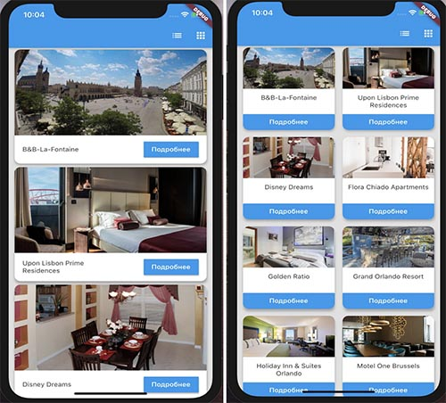
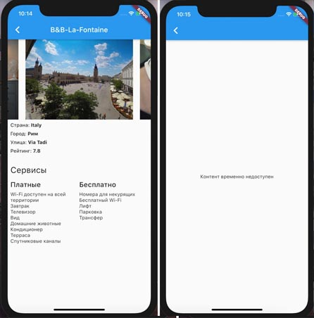

# flutter_home_work_http
Выполнил домашнее задание по http на курсе «Flutter» от Skillbox

**Описание домашнего задания**

1. Выберите библиотеку для работы с запросами (DIO или HTTP) 
2. Получите список отелей методом get по адресу https://run.mocky.io/v3/ac888dc5-d193-4700-b12c-abb43e289301 и отобразите на экране.
3. При загрузке отобразите прелоадер. Карточки с отелями могут отображаться в виде списка и плитки. Для переключения вида в AppBar есть две иконки (список и плитка).

4. При клике на кнопку «Подробнее» настройте переход на страницу с детальной информацией об отеле. На ней должен присутствовать поля: страна, город, улица, рейтинг, сервисы (платные и бесплатные).
5. Обработайте ошибки сервера: если информация об отеле недоступна, возвращайтеc cообщение с ошибкой на экране

6. Для получения детальной информации нужно указать UUID
отеля, который получили при запросе списка всех отелей 
https://run.mocky.io/v3/${uuid}.
7. Изображения, имена которых приходят с сервера, добавить в папку assets/images.

**Критерии оценки**
- Дизайн и расположение элементов должны соответствовать скриншотам.
- Если сервер возвращает ошибку, она должна быть отображена на экране вместо детальной информации об отеле.
- Если детальная информация об отеле получена успешно, она должна отображаться на экране вместе со всеми полями.

**Результат выполненного задания**

Приложение разработано на версии:
- Flutter: v2.2.3
- Dart: v2.13.4

Платформа:
- Android, iOS

Используемые зависимости:
- http: ^0.13.3  

Добавил обработку ошибки отсутствующего интернета.

Демонстрация приложения:

